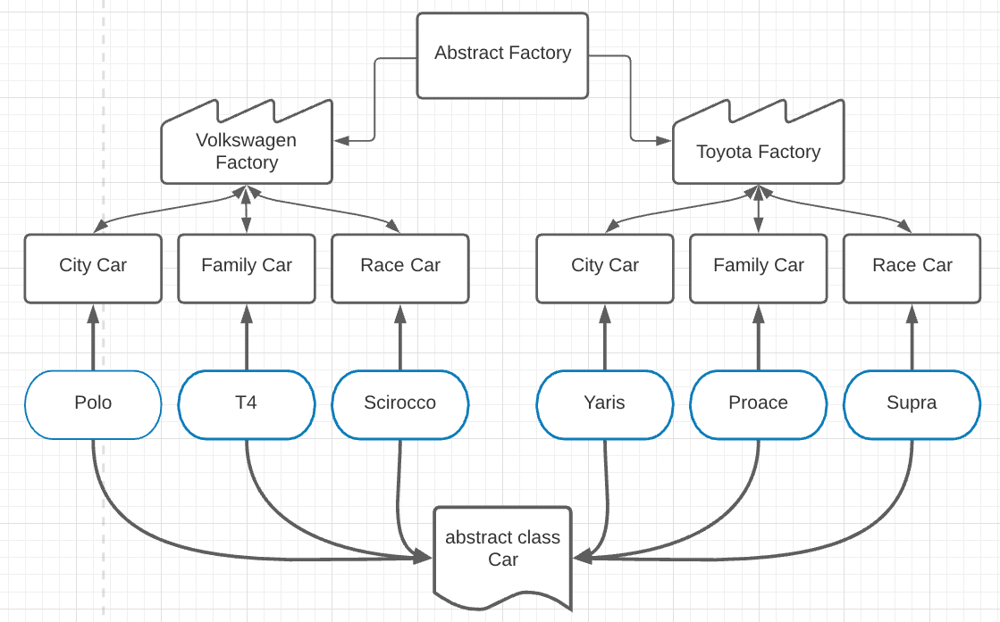
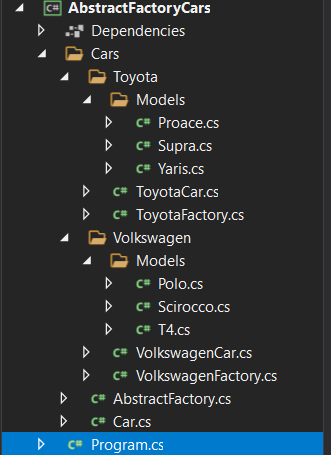
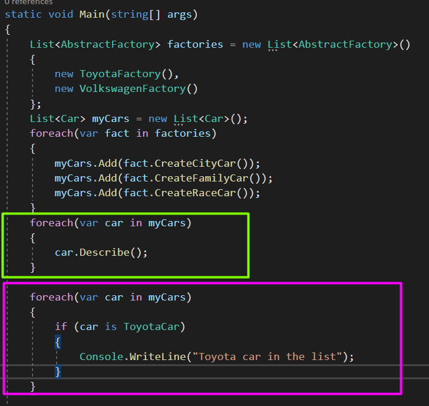
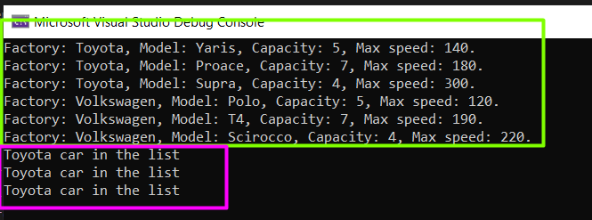

# AbstractFactoryCarsDemo

## Table of Contents
* [General Info](#general-information)
* [Technologies Used](#technologies-used)
* [Features](#features)
* [Screenshots](#screenshots)
* [Project Status](#project-status)
* [Contact](#contact)

## General Information
Using Abstract Factory Pattern to Create Volksvagen and Toyota cars

## Technologies Used
- C#
- Abstract Factory Pattern

## Features
- Creating objects in loops
- Recognizes type of car

## Screenshots

## Project Status
Project is: _complete_ 

## Contact
Created by [@ITKwiatek](https://github.com/ITKwiatek/) - feel free to contact me!
